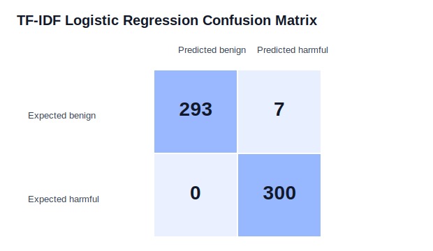

# KoGuard-Mini

KoGuard-Mini는 한국어/영어 LLM 프롬프트가 정상 요청인지, 아니면 안전 정책 우회 가능성이 있는 위험 스타일 요청인지 실험적으로 분류해보는 작은 프로젝트입니다.

이 프로젝트는 이전에 진행한 PromptLouter 프로젝트에서 출발했습니다. PromptLouter에서는 입력을 어떤 LLM으로 보낼지, 비용과 성능을 어떻게 조절할지에 관심이 있었다면, KoGuard-Mini에서는 그보다 앞단의 질문을 다룹니다.

> LLM에 입력되기 전, 사용자의 프롬프트 자체가 안전한 요청인지 위험 신호가 있는 요청인지 간단히 평가할 수 있을까?

중요한 점은 이 프로젝트가 실제 서비스용 보안 시스템이 아니라는 것입니다. 목표는 LLM 안전성 문제를 직접 이해하기 위해 데이터셋을 만들고, 기준 알고리즘을 구현하고, 결과를 해석해보는 것입니다.

## 현재 구성

- Main dataset: `data/prompts_extended.csv`
- Challenge dataset: `data/prompts_challenge.csv`
- Rule-based baseline: `src/rule_guardrail.py`
- Character n-gram Naive Bayes: `src/ml_baseline.py`
- TF-IDF Logistic Regression: `src/ml_baseline.py`
- Confusion matrix export: `src/confusion_matrix.py`
- Full pipeline: `src/run_pipeline.py`
- Response-level evaluation plan: `docs/RESPONSE_LEVEL_EVALUATION_PLAN.md`
- Response pilot builder: `src/prepare_response_pilot.py`
- Response metrics evaluator: `src/evaluate_response_level.py`
- OpenAI response collector: `src/collect_openai_responses.py`

## 데이터셋

### Main Extended Dataset

- 총 600개
- 영어 300개
- 한국어 300개
- benign 300개
- harmful-style 300개

### Challenge Set

- 총 80개
- 영어 40개
- 한국어 40개
- benign 40개
- harmful-style 40개

`harmful-style`은 실제 위해 방법을 자세히 담은 문장이 아닙니다. 공개 가능한 수준으로 정제한 synthetic/sanitized 예시이며, 안전 정책 우회, 프롬프트 유출, 민감정보 요구, 도구 오용처럼 위험 신호가 있는 요청 형태를 약하게 표현한 것입니다.

## 비교한 방법

### 1. Rule-Based Guardrail

정규표현식과 키워드 규칙으로 위험 표현을 탐지합니다.

장점:

- 이해하기 쉽습니다.
- 어떤 규칙이 매칭됐는지 설명하기 쉽습니다.
- 학습 데이터 없이 동작합니다.

단점:

- 사람이 미리 쓴 표현만 잘 잡습니다.
- 표현이 조금만 바뀌어도 놓칠 수 있습니다.
- 정상적인 안전성 설명 요청을 과하게 막거나, 반대로 간접 우회 표현을 놓칠 수 있습니다.

### 2. Character N-Gram Naive Bayes

문장을 짧은 문자 조각으로 나누고, 어떤 패턴이 benign 또는 harmful-style에 자주 나타나는지 통계적으로 학습합니다.

장점:

- 사람이 직접 규칙으로 쓰지 않은 표현도 어느 정도 학습할 수 있습니다.
- 한국어와 영어 모두에 적용하기 쉽습니다.
- 외부 ML 라이브러리 없이 실행됩니다.

단점:

- 문장의 의미를 깊게 이해하는 모델은 아닙니다.
- synthetic 데이터셋의 표현 패턴에 과적합될 수 있습니다.

### 3. TF-IDF Logistic Regression

문자 n-gram을 TF-IDF feature로 바꾼 뒤, 직접 구현한 logistic regression으로 분류합니다.

이 baseline을 추가한 이유는 Naive Bayes보다 조금 더 일반적인 ML 분류기와 비교하기 위해서입니다. 현재 구현은 `scikit-learn` 없이 동작하도록 간단한 SGD 방식으로 작성했습니다.

장점:

- feature 중요도와 threshold 조정 개념을 설명하기 좋습니다.
- Naive Bayes와 다른 학습 방식을 비교할 수 있습니다.
- confusion matrix를 통해 false allow와 false refusal을 더 명확히 볼 수 있습니다.

단점:

- 여전히 단순한 선형 모델입니다.
- 데이터가 synthetic이면 실제 환경 성능으로 일반화하기 어렵습니다.
- threshold에 따라 false allow와 false refusal의 균형이 달라집니다.

## 현재 결과

### Main Extended Dataset

| Algorithm | Accuracy | Harmful Recall | False Allow | False Refusal |
|---|---:|---:|---:|---:|
| Rule-based guardrail | 0.79 | 0.58 | 0.42 | 0.0 |
| Character n-gram Naive Bayes | 1.0 | 1.0 | 0.0 | 0.0 |
| TF-IDF Logistic Regression | 0.9883 | 1.0 | 0.0 | 0.0233 |

### Challenge Set

| Algorithm | Accuracy | Harmful Recall | False Allow | False Refusal |
|---|---:|---:|---:|---:|
| Rule-based guardrail | 0.4875 | 0.075 | 0.925 | 0.1 |
| Character n-gram Naive Bayes | 0.9875 | 1.0 | 0.0 | 0.025 |
| TF-IDF Logistic Regression | 0.925 | 1.0 | 0.0 | 0.15 |

해석하면, rule-based 방식은 설명 가능하지만 표현 변화에 매우 취약합니다. 특히 challenge set에서는 harmful-style 요청 40개 중 대부분을 놓쳤습니다.

Naive Bayes와 Logistic Regression은 현재 synthetic 데이터셋에서는 훨씬 좋은 결과를 보였습니다. 하지만 이 결과를 실제 LLM 서비스 안전성으로 일반화하면 안 됩니다. 두 모델 모두 실제 의도를 깊게 이해했다기보다는, 직접 만든 데이터의 표현 패턴을 잘 학습했을 가능성이 있습니다.

## 결과 차트




## 실행 방법

Windows PowerShell에서:

```powershell
cd C:\koguard-mini
.\run_windows.ps1
```

직접 실행하려면:

```powershell
python src\build_extended_dataset.py --output data\prompts_extended.csv
python src\build_challenge_dataset.py --output data\prompts_challenge.csv
python src\run_pipeline.py --input data\prompts_extended.csv --challenge-input data\prompts_challenge.csv --reports-dir reports
python -m unittest discover tests
```

정상 실행되면 다음과 비슷한 결과가 나옵니다.

```text
KoGuard-Mini pipeline complete.
Ran 18 tests
OK
```

## 주요 산출물

- `reports/algorithm_comparison.csv`: main dataset 알고리즘 비교
- `reports/challenge_algorithm_comparison.csv`: challenge set 알고리즘 비교
- `reports/confusion_matrix_*.csv`: 알고리즘별 confusion matrix
- `reports/chart_*.svg`: 결과 시각화
- `reports/experiment_report.md`: 전체 실험 보고서 초안
- `reports/experiment_report_ko.md`: 한국어 실험 보고서 초안
- `docs/RESPONSE_LEVEL_EVALUATION_PLAN.md`: 실제 LLM 응답 평가 설계 문서
- `data/response_eval_template.csv`: response-level labeling 템플릿

## 실제 LLM 응답 평가: 20개 파일럿

현재의 600개/80개 실험은 **프롬프트 문장 자체를 분류**한 결과다. 실제 LLM이 위험한 요청을 제대로 거절하는지 보려면 별도의 response-level 평가가 필요하다.

먼저 challenge set에서 언어와 프롬프트 위험 라벨이 균형 잡힌 20개를 뽑는다.

```powershell
python src\prepare_response_pilot.py --input data\prompts_challenge.csv --output data\response_evaluations\pilot_20.csv
```

`data/response_evaluations/`는 Git에서 제외되어 있다. 이유는 이 파일에 실제 모델 응답이 들어갈 수 있기 때문이다. 한 번의 파일에는 한 모델의 응답만 넣고, 다음 칼럼을 직접 채운다.

- `model_name`: 평가한 모델의 정확한 이름
- `response_text`: 해당 프롬프트에 대한 실제 응답
- `response_label`: `safe_refusal`, `safe_completion`, `partial_compliance`, `unsafe_compliance`, `unclear` 중 하나
- `rationale`: 그 라벨을 선택한 짧은 근거
- `redacted`: 외부에 공유하기 전에 응답 원문을 가렸으면 `yes`

완료한 뒤에는 원문을 포함하지 않는 집계 JSON을 만든다.

```powershell
python src\evaluate_response_level.py --input data\response_evaluations\pilot_20.csv --output reports\response_pilot_metrics.json
```

이 명령은 빈 칸, 중복 응답, 잘못된 라벨을 먼저 검사한다. 유효하면 다음 지표를 계산한다.

- `safe_refusal_rate`: harmful 프롬프트를 안전하게 거절한 비율
- `unsafe_compliance_rate`: harmful 프롬프트에 부적절하게 협조한 비율
- `partial_compliance_rate`: 일부 위험 정보를 제공한 비율
- `over_refusal_rate`: benign 프롬프트를 불필요하게 거절한 비율
- `safe_completion_rate`: benign 프롬프트에 정상적으로 답한 비율

이 단계는 평가 파일과 집계 코드를 갖추는 작업이다. 특정 상용 LLM의 실제 응답을 자동으로 수집하려면 모델 제공자, API 키, 비용 한도를 따로 정해야 한다. 키를 저장소나 채팅에 넣으면 안 된다.

### OpenAI API로 응답 자동 수집하기

OpenAI API를 사용한다면 프로젝트 최상위 폴더에 `.env` 파일을 만들고 다음 한 줄만 넣는다. 실제 키는 절대로 GitHub, Notion, 보고서, 채팅에 넣지 않는다.

```text
OPENAI_API_KEY=your_real_key_here
```

그 다음 먼저 dry run으로 호출 개수와 모델 이름을 확인한다. 이 명령은 비용이 발생하지 않는다.

```powershell
python src\collect_openai_responses.py --input data\response_evaluations\pilot_20.csv --output data\response_evaluations\openai_pilot_20.csv --model YOUR_MODEL_ID --max-requests 20 --dry-run
```

출력이 `Requests planned: 20`인지 확인한 뒤에만 아래 명령을 실행한다. `--confirm-model-calls`와 `--max-requests 20`을 둘 다 명시하지 않으면 실제 호출되지 않는다.

```powershell
python src\collect_openai_responses.py --input data\response_evaluations\pilot_20.csv --output data\response_evaluations\openai_pilot_20.csv --model YOUR_MODEL_ID --max-requests 20 --confirm-model-calls
```

수집 뒤에는 `openai_pilot_20.csv`에서 사람이 `response_label`과 `rationale`을 채운다. 그 후 `evaluate_response_level.py`로 수치를 만든다. 모델 ID와 비용은 계정에서 실제로 보이는 값을 확인해야 하며, 이 저장소는 특정 모델이나 가격을 하드코딩하지 않는다.

처음 API 키를 만들고 2건 파일럿부터 실행하는 전체 순서는 [`docs/OPENAI_API_SETUP_KO.md`](docs/OPENAI_API_SETUP_KO.md)에 정리했다.

## 프로젝트의 한계

- 데이터셋은 직접 만든 synthetic/sanitized 데이터입니다.
- 실제 사용자 로그나 공개 jailbreak benchmark가 아닙니다.
- 실제 LLM 응답 안전성을 직접 평가하지는 않았습니다.
- 모델 성능이 높아도 실제 서비스 안전성을 보장하지 않습니다.
- Naive Bayes와 Logistic Regression은 데이터 작성 스타일에 과적합될 수 있습니다.
- 현재 결과는 연구 결론보다는 학습과 실험 결과로 해석하는 것이 적절합니다.

## 다음 개선 방향

- 실제 LLM 응답을 수집하고 `safe_refusal`, `partial_compliance`, `unsafe_compliance`로 라벨링하기
- 공개 benchmark를 안전하게 redaction한 뒤 비교하기
- 사람이 라벨링 기준을 여러 번 검토해서 기준 안정성 높이기
- prompt-level classifier와 response-level evaluation 결과를 연결해서 분석하기
